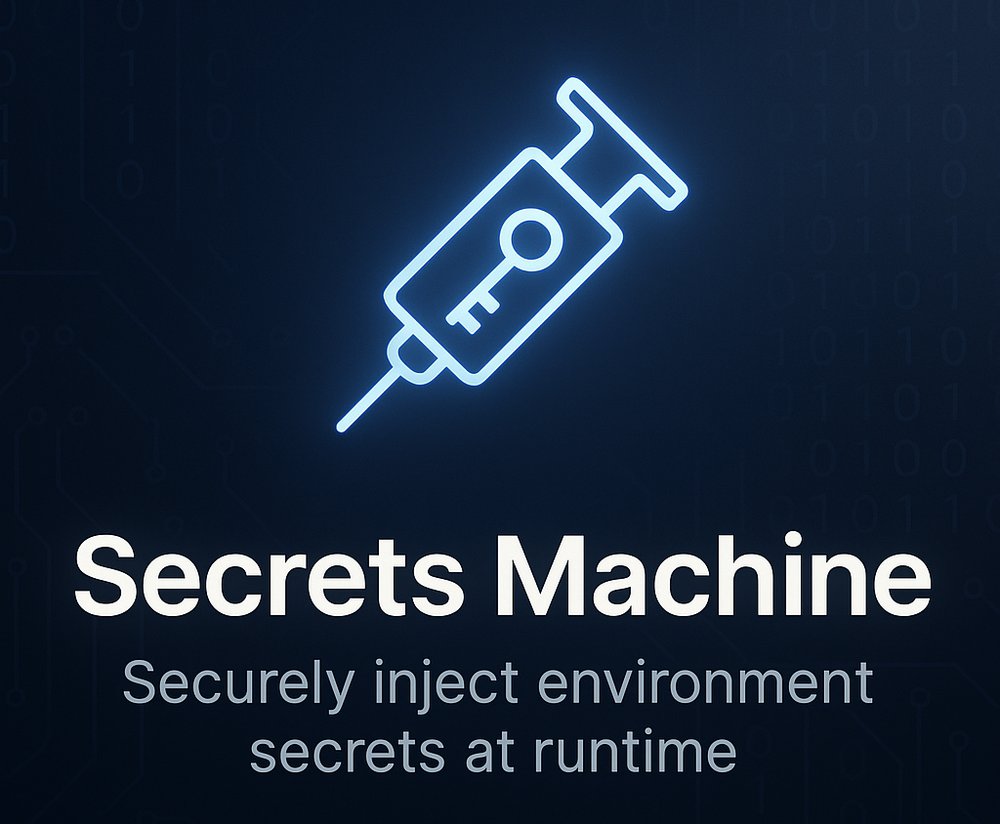

<div align="center">
  
</div>

<div align="center">
<a href="https://github.com/generative-ai-inc/secrets-machine/blob/main/LICENSE"></a>
<a href="https://github.com/generative-ai-inc/secrets-machine/actions/workflows/rust-clippy.yml?query=branch%3Amain"></a>
<a href="https://github.com/generative-ai-inc/secrets-machine/actions/workflows/build.yml?query=branch%3Amain"></a>
<a href="https://github.com/generative-ai-inc/secrets-machine/actions/workflows/test.yml?query=branch%3Amain"></a>
<a href="https://github.com/generative-ai-inc/secrets-machine/actions/workflows/release.yml"></a>
<a href="https://github.com/generative-ai-inc/secrets-machine/actions/workflows/github-code-scanning/codeql?query=branch%3Amain"></a>
</div>

<br />

# Why Secrets Machine?

Managing secrets across different environments and platforms can be challenging. Secrets Machine solves this by:

- **Unified Access**: Get secrets from multiple sources with a single consistent interface
- **Secure by Design**: Never store secrets in code or configuration files
- **No Code Changes**: Works with existing applications without requiring code modifications
- **Cross-Platform**: Works on MacOS and Linux with the same commands
- **Developer-Friendly**: Simple CLI that integrates with your existing workflow
- **CI/CD Ready**: Perfect for automation pipelines where secrets need to be injected at runtime

Secrets Machine standardizes how you access secrets regardless of where they're stored, making your development process more secure and efficient.

## 😕 Without Secrets Machine

```sh
$ python3
Python 3.12.4 (main, Jun  6 2024, 18:26:44) [GCC 11.4.0] on linux
Type "help", "copyright", "credits" or "license" for more information.
>>> import os
>>> os.getenv("MY_SECRET")
>>>
```

## 😊 With Secrets Machine

```sh
$ sm exec python3 # <--- This is the command that injects the secrets
Python 3.12.4 (main, Jun  6 2024, 18:26:44) [GCC 11.4.0] on linux
Type "help", "copyright", "credits" or "license" for more information.
>>> import os
>>> os.getenv("MY_SECRET")
>>> my-secret-value
```

Secrets are read from the following sources, in this order:

1. [Aliases](#aliases)
2. A dotenv file (.env)
3. Process environment variables
4. [Secret Managers](#secrets-managers)
5. [Keyring](#keyring)

Supported platforms (Contributions welcome!):

- MacOS
- Linux

## Installation

```sh
bash <(curl -sS "https://raw.githubusercontent.com/generative-ai-inc/secrets-machine/main/install.sh")
```

### Usage

To execute a command with secrets simply run `sm exec` and pass the command you want to run. For example:

```sh
sm exec 'cargo run'
sm exec 'python3'
sm exec 'pnpm run dev'
```

These are different ways to evaluate environment variables in your execution command. They are all equivalent:

```sh
sm exec 'echo "My secret is $MY_SECRET"' # This one is recommended
sm exec "echo \"My secret is \$MY_SECRET\""
sm exec "echo My secret is \$MY_SECRET"
# OUTPUT: My secret is my-secret-value
```

```sh
sm exec 'echo $MY_SECRET'
sm exec "echo \$MY_SECRET"
sm exec "echo \${MY_SECRET}"
# OUTPUT: My secret is my-secret-value
```

### Configuration File

You can customize the behavior of secrets machine by editing the configuration file. The configuration file can be located in the user's home directory or in the project root.

#### Location

##### User Configuration

The user configuration file is located at `~/.config/secrets-machine/config.toml`.

##### Project Configuration

The project configuration file is usually a file named `secrets_machine.toml` at the root of your project. You can specify a different file with the `--config` option. Any configuration in this file will override the user configuration.

See [secrets_machine.toml](https://github.com/generative-ai-inc/secrets-machine/blob/main/secrets_machine.toml) for an example.

#### Commands

In the `secrets_machine.toml` file, you can define commands that will be run in the secrets machine environment.

```toml
[commands]
  dev  = "cargo run"
  test = "cargo test"
```

You can then run the commands with `sm run <command-name>`, for example:

```sh
sm run dev
sm run test
```

#### Pre Commands

Pre commands are useful for setting up the environment before running the command.

```toml
[pre_commands]
  dev  = "unset ARGV0"
  test = "unset ARGV0"
```

#### Aliases

Aliases are useful for creating new environment variables from existing ones.

```toml
[aliases]
  NEXT_PUBLIC_API_KEY = "PUBLIC_API_KEY"
  VITE_ANON_KEY = "ANON_KEY"
```

This will set the value of `NEXT_PUBLIC_API_KEY` to the value of `PUBLIC_API_KEY`.
Similarly, `VITE_ANON_KEY` will be set to the value of `ANON_KEY`.

#### Secrets Managers

You can configure secrets managers in the `secrets_machine.toml` file at the root of each project.

Alternatively, you can configure them in the `~/.config/secrets-machine/config.toml` file to be used in all projects. We recommend using the keyring to store access tokens for secrets managers that are enabled in the user configuration so you don't have to manually add them to each project.

You can do this with the following command:

```sh
sm secret add MY_ACCESS_TOKEN
```

##### Bitwarden Secrets Manager

You can add one or more [Bitwarden Secrets Manager](https://bitwarden.com/products/secrets-manager/) sources to the configuration file with the following format:

```toml
[[secrets_sources]]
  name              = "bitwarden"
  access_token_name = "BWS_ACCESS_TOKEN"

[[secrets_sources]]
  name              = "bitwarden"
  access_token_name = "BWS_ACCESS_TOKEN_2"
```

### Keyring

You can also store secrets locally with the `sm secret add` command. These are encrypted using the system keyring and will be available any time you use secrets machine.

For example:

```sh
sm secret add GITHUB_TOKEN

# or all at once with a single command
sm secret add GITHUB_USERNAME <github-username>
```

## Suggestions

### Shell Autocomplete

#### Zsh

To add completions for zsh, execute the following:

```sh
mkdir -p ${ZDOTDIR:-~}/.zsh_functions
echo 'fpath+=${ZDOTDIR:-~}/.zsh_functions' >> ${ZDOTDIR:-~}/.zshrc
sm completions zsh > ${ZDOTDIR:-~}/.zsh_functions/\_sm
```

#### Other Shells

In general, you can generate completions for any shell with the following command:

```sh
sm completions <shell>
```

If you are not sure what to do with the output of this command, the people from Alacritty have a good [guide](https://github.com/alacritty/alacritty/blob/master/INSTALL.md#shell-completions) on how to add shell completions to your shell. In the guide it is assumed that you are adding the completions for the `alacritty` command, but the process is similar for other commands, like `sm`.
